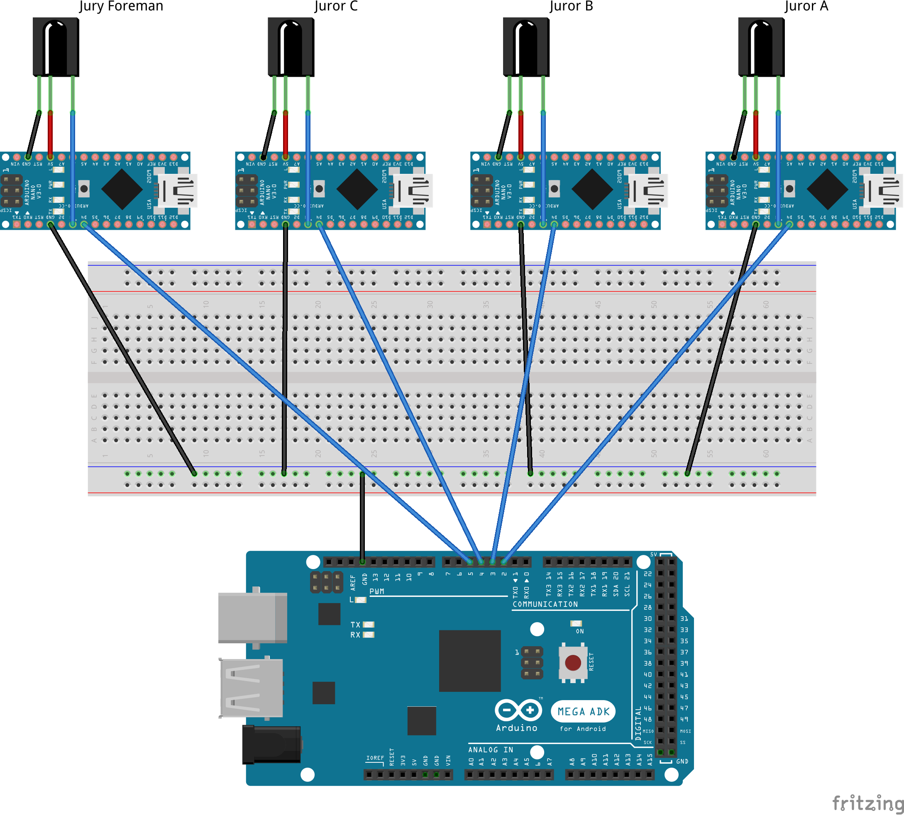

# InfraRed Communications for Captioning on Glass

This repository holds the Arduino code required to simulate real-time captioning using smart glasses.
## List of Materials
You will need:
- An Android device (a Google Pixel running LineageOS was used for experimentation)
- A USB OTG connector to connect your Android device to an Arduino
- 6 Arduino boards of any kind (recommended: 5 [Arduino Nano](https://store.arduino.cc/usa/arduino-nano)s + 1 [Seeeduino ADK Main Board](https://www.seeedstudio.com/Seeeduino-ADK-Main-Board-p-846.html))
- 4 IR Receiver Diodes (went with [TSOP38238](https://www.sparkfun.com/products/10266))
- 1 IR LED (went with [a 950mm from SparkFun](https://www.sparkfun.com/products/9349))
- Wires and resistors as necessary to keep your hardware from shorting.

The hardware should be set up to look something like this:

## Design
This system works using a primary/secondary approach.
One board mounted to the smartglasses outputs a constant IR signal, focused in the user's head orientation.
Secondary boards connected to IR receiver diodes receive the IR signal from the glasses, and output signals to a primary board connected to the Android device.
(The primary/secondary board approach was implemented to circumvent some limitations in the [Arduino-IRremote library involving multiple IR receivers](https://github.com/Arduino-IRremote/Arduino-IRremote/discussions/843)).
The primary board reads the secondary boards' outputs, and writes to the serial port so the Android can read it.
The Android device reads from the serial port (see [the Android app repository for more information](https://github.com/SaltyQuetzals/CaptioningOnGlass-Notify/)), and then sends messages to the smartglasses via Bluetooth.
The smartglasses then display the transmitted messages on the user's field of vision, simulating a real-time captioning experience.

